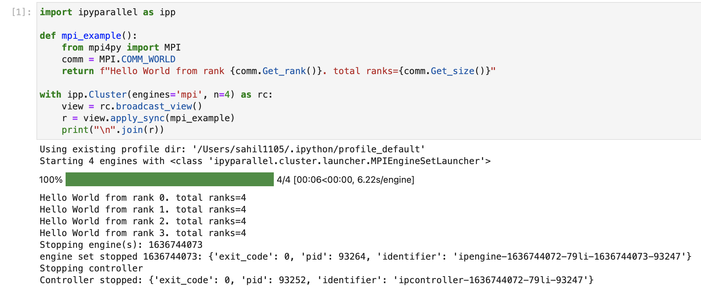

# Using IPython for parallel computing

> ```{eval-rst}
>
> :Release: |release|
> :Date: |today|
> ```

(install)=

## Installing IPython Parallel

As of 4.0, IPython parallel is now a standalone package called {mod}`ipyparallel`.
You can install it with:

```
pip install ipyparallel
```

or:

```
conda install ipyparallel
```

As of IPython Parallel 7,
this will include installing/enabling an extension for both the classic Jupyter Notebook
and JupyterLab ≥ 3.0.

## Quickstart

IPython Parallel

A quick example to:

1. allocate a cluster (collection of IPython engines for use in parallel)
2. run a collection of tasks on the cluster
3. wait interactively for results
4. cleanup resources after the task is done

```python
import time
import ipyparallel as ipp

task_durations = [1] * 25
# request a cluster
with ipp.Cluster() as rc:
    # get a view on the cluster
    view = rc.load_balanced_view()
    # submit the tasks
    asyncresult = view.map_async(time.sleep, task_durations)
    # wait interactively for results
    asyncresult.wait_interactive()
    # retrieve actual results
    result = asyncresult.get()
# at this point, the cluster processes have been shutdown
```

<video  autoplay loop width="100%">
<source src="_static/basic.mp4"/>
</video>

You can similarly run MPI code using IPyParallel (requires [mpi4py](https://mpi4py.readthedocs.io/en/stable/install.html)):

```python
import ipyparallel as ipp

def mpi_example():
    from mpi4py import MPI
    comm = MPI.COMM_WORLD
    return f"Hello World from rank {comm.Get_rank()}. total ranks={comm.Get_size()}"

# request an MPI cluster with 4 engines
with ipp.Cluster(engines='mpi', n=4) as rc:
    # get a broadcast_view on the cluster which is best
    # suited for MPI style computation
    view = rc.broadcast_view()
    # run the mpi_example function on all engines in parallel
    r = view.apply_sync(mpi_example)
    # Retrieve and print the result from the engines
    print("\n".join(r))
# at this point, the cluster processes have been shutdown
```



Follow the [tutorial][] to learn more.

[tutorial]: ./tutorial/index

## Contents

```{toctree}
:maxdepth: 2

tutorial/index
reference/index
```

```{toctree}
:maxdepth: 2

examples/index
```

```{toctree}
:maxdepth: 1

changelog
```

# IPython Parallel API

```{toctree}
:maxdepth: 2

api/ipyparallel.rst
```

# Indices and tables

- {ref}`genindex`
- {ref}`modindex`
- {ref}`search`
